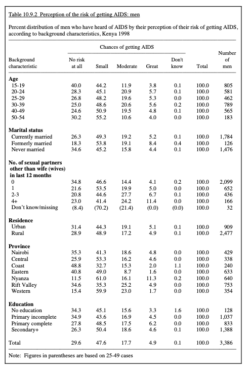

```{r setup, include=FALSE, echo= FALSE}
library(tidyverse)
library(scales)
library(knitr)
# code used to keep figures and text in the order https://gist.github.com/burchill/8873d2ade156b27e92a238a774ce2758
knitr::knit_hooks$set(plot = function(x, options) {
  paste0(knitr::hook_plot_tex(x, options), "\n\\FloatBarrier\n")
})
data <- readr::read_csv("../data/cleaned_data.csv")

```
\newpage
# Introduction

Being a sub-Saharan African country, Kenya bears one of the largest AIDS epidemics in the world. Despite the use of active antiretroviral therapy (ART) and other effective prevention methods, AIDS is still a major health problem that attracts the public’s attention[@prevent] in Kenya. As the best way to stop the spread of AIDS is to enhance people's knowledge about the disease itself, Demographic and Health Surveys were implemented to gather socio-demographic, behavioral, and ideological data on sexually transmissible diseases [@DHS]. 

While advocating changes to future health-related plans, it's also important to look back into the past to study the people's reactions, perceptions, and responses to similar matters in the past century. In the Kenya Demographic and Health Survey conducted in 1998, survey answers were collected to reflect the demographic, health, and living conditions of the average Kenyans[@DHS]. More precisely, this report extracts data from chapter 10 of the survey report, where Aids and other sexually transmitted diseases were discussed in detail. By using a data set taken and cleaned from two tables titled "AIDS-related knowledge," this report aims to analyze the impacts of genders, age groups, marital status, number of sexual partners, residence regions, provinces and education levels on people's perception of the risk of getting AIDs. In other words, this report analyzes the question: what are the chances of getting AIDS for people from different backgrounds? This report utilizes analytic programming language R [@citeR]. R packages tidyverse [@tidyverse], janitor [@janitor] and dplyr [@dplyr] are used to clean, organize and manipulate the data. Furthermore, R packages ggplot2 [@ggplot2], scales [@scales] and knitr [@knitr] are used to create figures and tables. R packages bookdown [@bookdown] and tinytex [@tinytex] are used to generate the R markdown Report.

By studying the many ways in which the knowledge of Aids can be influenced by the participants’ personal backgrounds, this report came to the conclusion that all the variables presented in the report have an impact on people’s perception of their chances of getting AIDS. As controlling the spread of AIDS is one of the most compelling topics in modern society, it’s exceedingly important to deconstruct the risk of catching the virus for people with different lifestyles and backgrounds.

This report is divided into three sections. The first section outlines the data that has been used to support the later analysis. Next, the second section discusses the trends observed from the data. Finally, the last section explores the progress that has been made in this report, the weakness of the analysis, and the future directions. The data and code that support this report can be found in the Github repository: Kenya_Demographic_1998.

# Data

## Data Description

### Variables 

Data used in this paper is extracted from table 10.9.1: Perception of the risk of getting AIDS: women and table 10.9.2 Perception of the risk of getting AIDS: men from the Kenya Demographic and Health Survey 1998 report [@DHS]. These two tables illustrate the female and male populations’ perceptions of their risk of getting the AIDS virus. Based on the tables, the independent variables include genders, age groups, marital status, number of sexual partners other than spouse, residence, province, and education. This report focuses on all the variables from the data set: the gender, age, marital status, number of sexual partners, residence region, province and education. To sum up, all these variables are analyzed in this report, and their impacts on the response variable, people’s perception of the risk of getting AIDS, are discussed. 

Figure \@ref(fig:tablef) and Figure \@ref(fig:tablem) are screen-shots of the tables in the orginal DHS report. These two tables are made based on the same survey question: What is your risk to be infected by AIDS? Figure \@ref(fig:tablef) shows the distribution of answers for female participants and Figure \@ref(fig:tablem) shows the distribution of answers for male participants. 

```{r tablef,fig.cap="Table on Page 164 of DHS Report", echo = FALSE}

```

```{r tablem,fig.cap="Table on Page 165 of DHS Report", echo = FALSE}

```

```{r tablec,fig.cap="First 10 Rows of cleanned Dataset", echo = FALSE}

tiny_data <- data %>%slice(1:10)
kable(tiny_data, caption="The first 10 Rows of cleaned Dataset", booktabs=TRUE)
```

### Similar Data Sets

The Kenya DHS 1998 provided many other interesting datasets that focused on various intriguing survey questions. For instance, table 10.8.1 in the DHS report outlined five AIDS-related questions and people’s general knowledge about the AIDS disease. Nevertheless, having too many questions leads to the difficulty of coming up with a concrete topic and conclusion. Indeed, it’s extremely redundant to have many similar questions studied in one report. Thus, the authors of this report have decided to use tables 10.9.1 and 10.9.2 for simplicity, practicability, and clarity purposes. By focusing on only one specific question, the report has an opportunity to explore the question and the variables in a more detailed, explicit, and professional manner. 

### The cleaning process

Variables from tables 10.9.1 and 10.9.2 were cleaned and reconstructed during data gathering and cleaning. In order to create and maintain a tidy dataset, the percent distribution of survey participants’ answers “no risk at all”, “small”, “moderate” and “great” to the survey question “chances of getting AIDS” were combined into one column called “chances_of_getting_AIDS”. A new column named “survey_answer” was also created to provide additional information on which survey answer the percent distribution under “chances_of_getting_AIDS” falls under. To continue maintaining a tidy dataset, the same treatment has been applied to background characteristics. Information on “age”, “No. of sexual partners other than husband/wife in last 12 months”, “province”,“education”,"marital status", and "residence" in the column was selected and renamed to “demographic_info”, and a new column named “demographic_type” was also created to provide additional information on which type of “demographic_info” falls under. A table with the first 10 rows of the filtered and cleaned data was shown in table 1.

## Methodology

The DHS program collects demographic data from countries across the world using model questionnaires. Compared to other surveys, the data collecting process for the DHS program is lengthy and selective. First, household questionnaires are distributed to the households in the studied region, and the specific information of the family members were collected. For example, the questionnaire collects the height, weight, age and other characteristic information from the children, men and women in the household. [@program] Then, the program will select the qualified individuals for individual interviews. The qualified individuals are usually the reproductive age groups of women ranging in age of 15-49 years old and men of 15-59 years old [@program]. Moreover, the questionnaires are not always the same. Other types of questionnaires are also utilized by the DHS program to serve other topics such as education, health care providers, young adults, etc. [@program] It’s also important to note that the questionnaire provided by the DHS program differs from one country to another, as each country has unique systems, culture and laws. Hence different model questionnaires are employed in different countries.

## Visualization

The following figures represent the visualizations for the percent distribution of each survey answer to the question “What are your chances of getting AIDS” across the selected survey participants' backgrounds of age, number of sexual partners, province, education, and gender. Due to the nature of the data, gender is the only variable that has cross data with other demographic information, which allows us to study the effect of its interactions with other demographic information. Thus, the visualizations for age, number of sexual partners, province, education, marital status, and residence were all split into males and females. The report aims to study the relationship between survey participants' perception of the risk of AIDS and their demographic background, and how each demographic information can influence their perception of receiving AIDS in the near future. Due to the large amount of figures, this section will showcase only the percentage distribution of survey answers by provinces. The data visualization for other demographic backgrounds are available in the apendix.
```{r provm, fig.cap="Percentage Distribution of Survey Answers by Provinces", echo = FALSE,fig.width=8, fig.height=4}


province_diverging <- data %>%
  filter(demographic_type == "province") %>%
  mutate(chances_of_getting_aids = if_else(survey_answer %in% c("no risk at all", "small"), -chances_of_getting_aids, chances_of_getting_aids)) %>%
  mutate(percent_label = abs(chances_of_getting_aids)) %>%
  mutate(percent_label = percent(chances_of_getting_aids / 100, accuracy = 1))

province_diverging %>% filter(gender == "male")%>%
  ggplot(aes(
    x = demographic_info,
    y = chances_of_getting_aids,
    fill = survey_answer
  )) + geom_col() +
  geom_text(aes(label = percent_label),
    position = position_stack(vjust = 0.5),
    color = "white",
    fontface = "bold"
  ) +
  coord_flip() +
  scale_x_discrete() +
  scale_fill_manual(
    breaks = c  ("no risk at all", "small", "moderate", "great"),
    values = c(
      "no risk at all" = "darkslategray4",
      "small" = "darkslategray2",
      "moderate" = "deepskyblue2",
      "great" = "deepskyblue4"
    )
  ) +
  labs(
    title = "What are your chances of getting AIDS? (Male)",
    x = "province",
    fill = NULL
  ) +
  theme_minimal() +
  theme(
    axis.title.y = element_text(margin = margin(r = 20)),
    axis.text.x = element_blank(),
    axis.title.x = element_blank(),
    panel.grid = element_blank(),
    legend.position = "top"
  )
```
```{r provf,fig.cap="Percentage Distribution of Survey Answers by Provinces", echo = FALSE ,fig.width=8, fig.height=4}

province_diverging %>% filter(gender == "female")%>%
  ggplot(aes(
    x = demographic_info,
    y = chances_of_getting_aids,
    fill = survey_answer
  )) + geom_col() +
  geom_text(aes(label = percent_label),
    position = position_stack(vjust = 0.5),
    color = "white",
    fontface = "bold"
  ) +
  coord_flip() +
  scale_x_discrete() +
  scale_fill_manual(
    breaks = c("no risk at all", "small", "moderate", "great"),
    values = c(
      "no risk at all" = "pink4",
      "small" = "pink2",
      "moderate" = "brown2",
      "great" = "brown4"
    )
  ) +
  labs(
    title = "What are your chances of getting AIDS? (Female)",
    x = "Provinces",
    fill = NULL
  ) +
  theme_minimal() +
  theme(
    axis.title.y = element_text(margin = margin(r = 20)),
    axis.text.x = element_blank(),
    axis.title.x = element_blank(),
    panel.grid = element_blank(),
    legend.position = "top"
  )
```


# Results
## Age 
Figure \@ref(fig:agesca) shows the response distribution to "chances of getting AIDS" from survey participants of all ages. This figure has shown whether age has an influence on participants' selected survey answers. To start off, most participants aged 15-19 answered small or no risk at all, while only around 20% of them answered moderate or great risks. However, the distribution of answers changes as age increases. Firstly, the percentage of participants selecting the option "no risk at all" drops significantly as age increases and bounces back up a bit as age reaches 50+. On the other hand, the distribution of option "moderate" displayed the exact opposite trend compared to "no risk." There are two ways to interpret the trends, the occurrence of sexual activities and the perception of AIDS-related knowledge. The higher rate of "no risk" answers among aged 15 to 19 participants may be due to them being so young; sex and AIDS are new concepts to them. Thus, it is reasonable to assume that the young population has a lower occurrence of sexual activities and possesses a minimal amount of AIDS-related knowledge. When participants get older, their sexual activities and AIDS-related knowledge are likely to increase as they gain more experiences, which can be explained in the plot by both a downwards trend of "no risk at all" and an upwards trend of "moderate." As participants reach the age of 50 +, the occurrence of sexual activities is likely to decrease due to their maturity and or physical capacity, which explains in the plot as "no risk at all" curves up and "moderate" curves down when participants age further increases. However, it is difficult to interpret late adulthood's perception of AIDS as some may be well informed on AIDS-related knowledge while some may be too old or isolated to receive such knowledge. Thus, it is unclear whether the trend displayed for elders can represent the overall perception of AIDS-related knowledge.

The distribution of "small risk" shares a similar trend with "no risk at all" due to the same interpretations and reasons, and the same case applies to "great risk" with "moderate risk." However, both "small" and "great" appear to have flatter curves, as age seems to have a lesser influence when participants select these options. 

When comparing the plots between females and males, the distribution of answering "no risk at all" is almost identical. However, females believe they have a higher risk of receiving AIDS as the plot shows that they are more likely to answer "moderate risk" and "great risk" than "small risk" when compared to males.
```{r agesca, fig.cap="Survey Participants Distribution for Age", echo = FALSE, message = FALSE, warning = FALSE, fig.width=8, fig.height=4}

datae <- data %>% filter( demographic_type == "age group")

scatterPlote <- ggplot(datae, aes(demographic_info, chances_of_getting_aids, color = survey_answer)) +labs(color = "Survey Answers") +
  geom_point() + facet_wrap(~gender)+ 
  stat_smooth(aes(group = survey_answer), method = "loess", se = FALSE, lty='dashed') +
  labs(
    x = "age",
    y = "percent distribution of survey participants",
    fill = NULL
  )+scale_color_brewer(
    palette="Spectral")+
  theme_minimal()+
  theme(
    panel.background = element_blank(),
    axis.text.x = element_text(size=10, angle=60, hjust=1, vjust=1),
    axis.title.y = element_text(size=10, angle = 90),
    axis.text.y = element_text(size=12)
  )
scatterPlote
```
## Number of Sexual Partners other than Husband/Wife in the past Year

Figures \@ref(fig:numsca1) and \@ref(fig:numsca2) show the correlation between participants' number of sexual partners other than husband/wife in the past 12 months, and participants' selected survey answers through linear and non-linear lines. Logically, having more sexual partners other than the husband/wife increases the frequency of sexual activities and makes the survey participants vulnerable to more potential sources of AIDS. Thus, it is reasonable to assume that the number of sexual partners other than the husband/wife positively correlates with the risk of receiving AIDS. Thus, there should be a downward trend for both answers "no risk at all" and "small," and an upward trend for both survey answers "moderate" and "great." Overall, \@ref(fig:numsca1) displayed the same trends as expected. 

However, through non-linear lines in \@ref(fig:numsca2), the participants with 4 or more sexual partners other than husband/wife responded to the survey differently than expected. Although the percentage of "great risk" continues to rise, both females and males participants have a significant drop in the percentage of selecting "moderate risk" when it is expected to continue rising like "great risk." There is even an around 3% increase for male participants who have 4 or more sexual partners to select the option "no risk at all." It is clear that survey participants with 4+ sexual partners generally have a lower perception of the risk of getting AIDS, and the importance of prevention measures was neglected. 

Similar to the age groups, when comparing the number of sexual partner plots between females and males, females seem to have higher awareness and stronger beliefs that they have a higher risk of receiving AIDS as the plot shows that they are more likely to answer "moderate risk" and "great risk" than "small risk" when compared to males.

```{r numsca1, fig.cap="Survey Participants Distribution for Number of Sexual Partner (linear)", echo = FALSE, message = FALSE, warning = FALSE, fig.width=8, fig.height=4}

datae <- data %>% filter( demographic_type == "No. of sexual partner other than husband/wife in past year")

scatterPlote <- ggplot(datae, aes(demographic_info, chances_of_getting_aids, color = survey_answer)) +labs(color = "Survey Answers") +
  geom_point() + facet_wrap(~gender)+ 
  stat_smooth(aes(group = survey_answer), method = "lm", se = FALSE, lty='dashed') +
  labs(
    x = "No. of sexual partner other than husband/wife",
    y = "survey participants' distribution",
    fill = NULL
  )+scale_color_brewer(
    palette="Spectral")+
  theme_minimal()+
  theme(
    panel.background = element_blank(),
    axis.text.x = element_text(size=10, angle=60, hjust=1, vjust=1),
    axis.title.y = element_text(size=10, angle = 90),
    axis.text.y = element_text(size=12)
  )
scatterPlote
```
```{r numsca2, fig.cap="Survey Participant Distribution for Age (Non-Linear)", echo = FALSE, message = FALSE, warning = FALSE, fig.width=8, fig.height=4}

datae <- data %>% filter( demographic_type == "No. of sexual partner other than husband/wife in past year")

scatterPlote <- ggplot(datae, aes(demographic_info, chances_of_getting_aids, color = survey_answer)) +labs(color = "Survey Answers") +
  geom_point() + facet_wrap(~gender)+ 
  stat_smooth(aes(group = survey_answer), method = "loess", se = FALSE, lty='dashed') +
  labs(
    x = "No. of sexual partner other than husband/wife",
    y = "percent distribution of survey answer",
    fill = NULL
  )+scale_color_brewer(
    palette="Spectral")+
  theme_minimal()+
  theme(
    panel.background = element_blank(),
    axis.text.x = element_text(size=10, angle=60, hjust=1, vjust=1),
    axis.title.y = element_text(size=10, angle = 90),
    axis.text.y = element_text(size=12)
  )
scatterPlote
```
## Province
 Figure \@ref(fig:provm) and Figure \@ref(fig:provf) depict people’s perception of their risk of getting AIDS from different provinces. Figure \@ref(fig:provm) demonstrates results from male survey participants, whereas Figure \@ref(fig:provf) shows the results from female participants. First of all, according to Figure \@ref(fig:provm), the results of the survey question were significantly affected by the region factor. In other words, people from different regions are very likely to have different perspectives regarding their chances of being infected. For instance, the number of people who answered “no risk at all” to the survey question in Coast Kenya(49%) is much higher than those who lived in Nyanza (12%). This feature is also visible in other categorical options such as “small,” “moderate,” and “great.”
In contrast, in Figure \@ref(fig:provf), women from different regions tend to have similar answers to their risk of getting AIDS. Even though there are small differences among the numbers of answers, their answers were consistent throughout the provinces. The only interesting point is that the number of women who thought they were very likely to catch the virus in Nyanza and Nairobi is much higher than in the other provinces. By combining the conclusions made in Figure \@ref(fig:provm), it’s fair to conclude that both the male and female population living in Nyanza felt like they had a higher chance of getting the AIDS virus than the people living in other provinces. 

Furthermore, Figure \@ref(fig:privsca) is a multi-variable bar chart that shows the perception of the risk of getting AIDS from survey participants of both male and female living in different provinces. In the scatter-plot, the answers of each group of populations were illustrated. In the plot, the number of people who stated their chances of getting AIDS were “great” was highest in Kenya. Similarly, in Kenya, the number of people who claimed that they have “no risk at all” was also lowest in comparison to other provinces. In fact, Nyanza has an average AIDS rate of 14.7%, which is much higher than Kenya’s national average (9%)[@bondo]. This social trend is primarily caused by the Luo ethnic group in Kenya, in which the women have low social status and cannot refuse to have sex with their husbands [@bondo]. In the Luo community, it’s also common for men to have extramarital affairs. Thus, the dominant role of sex within the Luo community and the low status of women leads to the high incidence of AIDS in the Luo community. 

In contrast, according to the survey participants, the risks of being infected were low in Coast, Western and Eastern Kenya. In Figure \@ref(fig:privsca), the number of people who answered “great” was low, and the number of people who answered “no risk at all” was high in these three provinces. These features can be explained by the different cultures and communities existing within these areas. In a word, people may have contrasting views about sex, marriage, and sexual hygiene due to different traditions, customs, and ideologies. 

```{r privsca, fig.cap="Survey Participant Distribution for Provinces", echo = FALSE, fig.width=8, fig.height=4}

data_prov = data %>% filter( 
  demographic_type == "province")

theme_bw <- 
  options(repr.plot.width=15, repr.plot.height=6)
  ggplot(data = subset(data_prov,(!is.na(survey_answer))),  aes(demographic_info, chances_of_getting_aids, fill = survey_answer)) +labs(fill= "Survey Answers") +
         geom_bar(stat = "identity") + 
         scale_y_continuous(name="Percentage") +
         ggtitle("Survey Participant Distribution for Provinces") +
         scale_x_discrete(name="Province") +
         theme_bw()
```

## Education


Figure \@ref(fig:edum) shows the male participants’ perceptions about their chances of getting the AIDS virus. In the graph, a great number of people thought that their chances of getting AIDS were small, and only a small portion of the population stated that their chances of being infected were “great.” More precisely, for those with at least a secondary school degree, 26% of them claimed that they faced no risk at all. Similarly, 50% of them stated that their chances of being infected are small; 19% said their infected chance is moderate, and only 5% of them stated that their chances are great. To sum up, this bar chart shows that the data remains constant among different groups of people with different education levels. The small fluctuations that exist in the numbers can hardly explain the influence of different education levels on people’s perceptions about getting infected. Besides, Figure \@ref(fig:eduf) demonstrates the answers from female participants who held different levels of education degrees. Similar to Figure \@ref(fig:edum), the female participants with different educational backgrounds tend to have homogeneous answers in terms of their chances of getting AIDS. Nevertheless, a small difference existed in the graph: the number of women with at least a secondary degree said that their chances of getting infected (11%) were slightly higher than those with no education (7%).  

The answers of the participants with different education backgrounds are also demonstrated in Figure \@ref(fig:edusca). This scatterplot has indicated people with four types of school degrees: no education, primary incomplete, primary complete, and secondary.  From the plot, the number of men who answered “small” when being asked about their risk of getting AIDS has a proportional relationship with their degree levels. That is to say, the higher their degree levels are, the higher chance that they state to have “small” chances of being infected. On the other hand, the curves observed in the plot for women are flat in comparison to those of the men. In addition, it’s interesting to point out that in the women’s plot, the chances of answering “great” increases with their education levels. Hence, the higher the degree is, the higher chance that the women think that they will have a great chance of getting the disease. It’s fair to conclude that the education factor has a small impact on people’s perception of the risk of getting AIDS.


```{r edusca, fig.cap="Survey Participant Distribution for Education", echo = FALSE, message = FALSE, warning = FALSE, fig.width=8, fig.height=4}
#Education

datae <- data %>% filter( demographic_type == "education")

datae$demographic_info <- factor(datae$demographic_info,levels = c("No education", "Primary incomplete", "Primary complete", "Secondary+"))

scatterPlote <- ggplot(datae, aes(demographic_info, chances_of_getting_aids, color = survey_answer)) +labs(color = "Survey Answers") +
  geom_point() + facet_wrap(~gender)+ 
  stat_smooth(aes(group = survey_answer), method = "loess", se = FALSE, lty='dashed') +
  labs(
    title = "Survey Participant Distribution for Education",
    x = "education",
    y = "survey participants",
    fill = NULL
  )+scale_color_brewer(
    palette="Spectral")+
  theme_minimal()+
  theme(
    panel.background = element_blank(),
    axis.text.x = element_text(size=10, angle=60, hjust=1, vjust=1),
    axis.title.y = element_text(size=10, angle = 90),
    axis.text.y = element_text(size=12)
  )
scatterPlote
```


## Marital Status

(Figure \@ref(fig:comarm)) showcases the correlation between participants’ marital status past 12 months and participants' selected survey answers through both linear and non-linear lines. For female and male participants, the line depicts that the “no risk at all” to the chances of getting AID increases once the participant is not married or is formerly married. Overall, the perception of getting AIDS amongst male and female participants is positively correlated to the marital status, in terms of it increases when they’re currently married, to never married as expected. The relationship between the perception of getting AIDS and it being a “small”, “moderate” and “great” risk almost show a similar pattern for male and female participants both. Their perception of AIDS being a “small” risk is lower for those currently married, increases once formerly married, and decreases when never married, this pattern is similar to the male participants' “great” and “moderate” perception of getting AIDS as well.  The pattern for “great” and “moderate” chances for female participants has a similar linear trend as they’re decreasing. 

The difference between the perception of male and female participants as shown in the graph (Figure \@ref(fig:maritalm)) and (Figure \@ref(fig:maritalf)) are based on several factors, some of which may include differences in societal expectations for men versus women, education, customs, and ideologies.

```{r comarm, fig.cap="Survey Participant Distribution for Marital Status", echo = FALSE, message = FALSE, warning = FALSE, fig.width=8, fig.height=4}

#Correlation for marital status
datam<- data %>% filter( demographic_type == "marital status")

scatterPlot1 <- ggplot(datam, aes(demographic_info, chances_of_getting_aids, color = survey_answer)) +
  geom_point() + facet_wrap(~gender)+
  stat_smooth(aes(group = survey_answer), method = "loess", se = FALSE, lty='dashed') +
  labs(
    title = "Survey Participant Distribution",
    x = "Marital Status",
    y = "survey participants",
    fill = NULL
  )+scale_color_brewer(
    palette="Spectral")+
  theme_minimal()
scatterPlot1

```

## Residence Region


(Figure \@ref(fig:coress)) showcases the correlation between participants’ region of residence and participants' selected survey answers through both linear and non-linear lines. From societal understanding, it would be safe to assume that residents living in the urban area would have more access to information and the safety of diseases as there would be more sources of accessing that information. Thus, it is reasonable to assume that residents who reside in urban areas would have more behavioral changes in terms of perception of the chances of getting AIDS, due to the comparitve influx of information. Thus, we should expect downwards trends for both survey answers “no risk at all”, “moderate” and “small” for urban compared to rural. Overall, the figure for female participants showcased a similar trend as expected. 

The graphs below depict the answers of participants on rural and urban sides about their chances of getting the AIDS virus.  There may be several factors affecting their perception of their chances of getting AIDS on both sides, some of which may include education, differences in societal expectations, marriage, customs, and ideologies. 


```{r coress, fig.cap="Survey Participant Distribution for Marital Status", echo = FALSE, message = FALSE, warning = FALSE, fig.width=8, fig.height=4}

#Correlation for residence 
datar <- data %>% filter( demographic_type == "residence")

scatterPlot1 <- ggplot(datar, aes(demographic_info, chances_of_getting_aids, color = survey_answer)) +
  geom_point() +  facet_wrap(~gender)+
  stat_smooth(aes(group = survey_answer), method = "lm", se = FALSE, lty='dashed') +
  labs(
    title = "Survey Participant Distribution",
    x = "Residence",
    y = "survey participants",
    fill = NULL
  )+scale_color_brewer(
    palette="Spectral")+
  theme_minimal()
scatterPlot1

```


# Discussion

## What is done in this paper?

The perception of the risk of getting AIDS is considered to be the first stage toward behavioral change from risk-taking to safer behavior [@akwara]. From the findings above, the paper and results observe the perception and attitude of residents in Kenya towards AIDS and their chances of getting AIDS. The paper explores the relationship between education, marital status, province, number of sex partners, residence, and age with the perception of chances of getting AIDS. HIV/AIDS has been and continues to cause major concerns due to its devastating impact at present, there exists no cure or vaccine for HIV/AIDS and the only way to stop its spread is through behavioral and attitudinal change [@ndambuki] This paper helps in understanding how different socioeconomic factors affect the perception of the risk of getting HIV/AIDS and therefore helps the Government of Kenya could use this information to form comprehensive target policies for 1. Imparting skills for self-protection from vulnerability to sex and HIV/AIDS infection. 2. Provide life skills that build and enhance self-esteem, self-worth, and self-confidence. 3. Targeted guidance and spread of awareness for different socio-economic demographics.

## What is something we learn about the world?

There is a high rate of poverty and illiteracy in Kenya, which accounts for the difference in the residents with the respect to access to living regions and residence, access to different levels of education, and the perception of the chances of getting AIDS which is not accounted for by the Demographic and Health Surveys in 1998. Therefore there is no information on the income or economic status of the resident in this survey which could help eliminate bias.

The fact that HIV/AIDS is a multi-faceted, multi-sectoral problem was not understood and appreciated in the initial responses to the pandemic in Kenya [@ndambuki]. It was much later that the need for a comprehensive policy was recognized and addressed seriously [@ndambuki]. Due to the delay in the comprehensive policymaking, the awareness gradually took time penetrating to different provinces of Kenya. Along with this and the societal beliefs, ideologies and expectations, and cultural values in terms of hygienic sexual behavior, there were different rates of awareness in provinces. The province of Nyanza has the highest number of participants who think that they have a great risk of getting infected. The first AIDS case in Kenya was diagnosed in 1984 and after a  year, in 1985, the government of Kenya established a National AIDS Committee to advise on matters related to HIV/AIDS [@ndambuki]. HIV/AIDs awareness was included in the education curriculum of schools in Kenya in 2000. As shown in Figure \@ref(fig:edusca), a higher education level results in a greater chance of having the perception of a “small” risk of AIDS amongst male participants. This could be due to a higher awareness rate with education but since HIV/AIDS-related topics weren't included until after this survey, it is ambiguous. 

Due to the lack of awareness and vaccines, the perception of the chances plays a huge role in behavioral changes toward the disease. There exists a higher awareness rate amongst female participants in general, as compared to the male participants. There is a lower awareness and perception of the risk of getting AIDS among the youth of Kenya, which is disadvantageous as it increases the risk and decreases the chances of behavioral changes. Economically, this low awareness comes with a disadvantage due to a higher male-to-female ratio in the labor force. Due to the low perception and risk amongst youth, risky behavior could translate to a higher chance of getting infected, lowering the participation in the labor force, and leading to a plummeting labor force productivity. The economic effects of the lack of implementation of policies resulted in a loss of labor supply and costs such as the direct costs of AIDS include expenditures for medical care, drugs, and funeral expenses, and indirect costs include lost time due to illness, recruitment, and training costs to replace workers, and care of orphans [@mwangi_2022].

## Weakness

Weaknesses exist in this report as the data set used can be biased and incomplete. First, the data used in the original DHS report was collected from several types of questionnaires [@program]. People first need to complete a household questionnaire, and based on the responses; some qualified individuals will be selected to be interviewed using an individual questionnaire. For instance, most eligible survey participants are people of reproductive age (15-19 years old for women and 15-59 for men).[@program] Thus, a selection bias occurs during the data collecting process as only a certain group of the whole population was selected to contribute to the DHS program. With the issues discussed in this report, it’s important to acknowledge that not only the reproductive group is exposed to this deadly disease. The children and the aged population also face the risk of getting AIDS through mother-to-child transmission and blood transmission[@trends]. Moreover, the non-response bias and voluntary bias also contribute to the weakness of the data. As some people may not have the opportunity to answer the questionnaires and some people only answer the sections that they want to, the answers to the survey questions can also be biased. 

In addition, the data used in this report was extracted from only two tables from the original DHS report: one table for men and one for women. Thus, the information regarding people’s reactions to AIDS is very limited, and some of the critical features of the issue remain missing. For instance, we only have the percentage distribution of the whole population but not the actually recorded observation. This particular nature of the data made the dataset difficult to clean in order to maintain a tidy format, it also blocked us from studying the interaction effects of survey participants’ demographic backgrounds on their choices of survey answer.

Indeed, understanding the perception of the risk of getting AIDS alone is not sufficient to make perfectly significant and powerful statements about the conditions of AIDS in the country. As this disease has bothered the Kenyans for decades and continues to threaten lives worldwide, its obligatory to focus on all aspects of the disease before making decisive answers to the problem.

It’s always important for the readers to always acknowledge the flaws in this analysis, as they may potentially affect the effectiveness, clarity, and correctness of the statements made in the report. 


## Future Directions

AIDS is a transmissible disease that cannot be cured. Being a dreadful disease that has infected more than 35 million people worldwide, it can only be controlled with active therapy and medications[@deeks]. In this report, by analyzing the answers from people from various backgrounds, the chances of them being infected with AIDS were analyzed in detail. However, studying people’s perceptions alone is not enough to make fair conclusions about the nature, the trends, and the effective prevention methods of the disease. Other factors such as people’s knowledge about AIDS, the universalization rate of effective prevention methods, and the availability of healthcare in the studied region are also crucial to the impacts of the disease. In addition, the DHS report studied in this analysis was published in 1998, signifying that it has lost some relevance to modern society. Hence, in the future, more up-to-date reports will be reviewed to achieve a better understanding of the different aspects of the disease. In hopes of reducing the negative influence of AIDS on people’s daily life, this analysis aims to educate the public about the seriousness of sexually transmissible diseases, outline the factors that increase the infection rate, and promote future governmental and health plans. 

# Apendix
```{r agevm, fig.cap="Percentage Distribution of Survey Answers by Age", echo = FALSE,fig.width=8, fig.height=4}

age_diverging <- data %>%
  filter(demographic_type == "age group") %>%
  mutate(chances_of_getting_aids = if_else(survey_answer %in% c("no risk at all", "small"), -chances_of_getting_aids, chances_of_getting_aids)) %>%
  mutate(percent_label = abs(chances_of_getting_aids)) %>%
  mutate(percent_label = percent(chances_of_getting_aids / 100, accuracy = 1))

age_diverging %>% filter(gender == "male")%>%
  ggplot(aes(
    x = demographic_info,
    y = chances_of_getting_aids,
    fill = survey_answer
  )) + geom_col() +
  geom_text(aes(label = percent_label),
    position = position_stack(vjust = 0.5),
    color = "white",
    fontface = "bold"
  ) +
  coord_flip() +
  scale_x_discrete() +
  scale_fill_manual(
    breaks = c  ("no risk at all", "small", "moderate", "great"),
    values = c(
      "no risk at all" = "darkslategray4",
      "small" = "darkslategray2",
      "moderate" = "deepskyblue2",
      "great" = "deepskyblue4"
    )
  ) +
  labs(
    title = "What is your chances of getting AIDS? (Male)",
    x = "age",
    fill = NULL
  ) +
  theme_minimal() +
  theme(
    axis.title.y = element_text(margin = margin(r = 20)),
    axis.text.x = element_blank(),
    axis.title.x = element_blank(),
    panel.grid = element_blank(),
    legend.position = "top"
  )
```
```{r agevf, fig.cap="Percentage Distribution of Survey Answers by Age", echo = FALSE,fig.width=8, fig.height=4}

age_diverging <- data %>%
  filter(demographic_type == "age group") %>%
  mutate(chances_of_getting_aids = if_else(survey_answer %in% c("no risk at all", "small"), -chances_of_getting_aids, chances_of_getting_aids)) %>%
  mutate(percent_label = abs(chances_of_getting_aids)) %>%
  mutate(percent_label = percent(chances_of_getting_aids / 100, accuracy = 1))

age_diverging %>% filter(gender == "female")%>%
  ggplot(aes(
    x = demographic_info,
    y = chances_of_getting_aids,
    fill = survey_answer
  )) + geom_col() +
  geom_text(aes(label = percent_label),
    position = position_stack(vjust = 0.5),
    color = "white",
    fontface = "bold"
  ) +
  coord_flip() +
  scale_x_discrete() +
  scale_fill_manual(
    breaks = c  ("no risk at all", "small", "moderate", "great"),
    values = c(
      "no risk at all" = "pink4",
      "small" = "pink2",
      "moderate" = "brown2",
      "great" = "brown4"
    )
  ) +
  labs(
    title = "What are your chances of getting AIDS? (Female)",
    x = "age",
    fill = NULL
  ) +
  theme_minimal() +
  theme(
    axis.title.y = element_text(margin = margin(r = 20)),
    axis.text.x = element_blank(),
    axis.title.x = element_blank(),
    panel.grid = element_blank(),
    legend.position = "top"
  )
```
```{r numm, fig.cap="Percentage Distribution of Survey Answers by Age", echo = FALSE,fig.width=8, fig.height=4}

num_diverging <- data %>%
  filter(demographic_type == "No. of sexual partner other than husband/wife in past year") %>%
  mutate(chances_of_getting_aids = if_else(survey_answer %in% c("no risk at all", "small"), -chances_of_getting_aids, chances_of_getting_aids)) %>%
  mutate(percent_label = abs(chances_of_getting_aids)) %>%
  mutate(percent_label = percent(chances_of_getting_aids / 100, accuracy = 1))

num_diverging %>% filter(gender == "male")%>%
  ggplot(aes(
    x = demographic_info,
    y = chances_of_getting_aids,
    fill = survey_answer
  )) + geom_col() +
  geom_text(aes(label = percent_label),
    position = position_stack(vjust = 0.5),
    color = "white",
    fontface = "bold"
  ) +
  coord_flip() +
  scale_x_discrete() +
  scale_fill_manual(
    breaks = c  ("no risk at all", "small", "moderate", "great"),
    values = c(
      "no risk at all" = "darkslategray4",
      "small" = "darkslategray2",
      "moderate" = "deepskyblue2",
      "great" = "deepskyblue4"
    )
  ) +
  labs(
    title = "What are your chances of getting AIDS? (Male)",
    x = "No. of sexual partner other than Wife",
    fill = NULL
  ) +
  theme_minimal() +
  theme(
    axis.title.y = element_text(margin = margin(r = 20)),
    axis.text.x = element_blank(),
    axis.title.x = element_blank(),
    panel.grid = element_blank(),
    legend.position = "top"
  )
```
```{r numvf, fig.cap="Percentage Distribution of Survey Answers by Number of Sexual Partners", echo = FALSE,fig.width=8, fig.height=4}

num_diverging <- data %>%
  filter(demographic_type == "No. of sexual partner other than husband/wife in past year") %>%
  mutate(chances_of_getting_aids = if_else(survey_answer %in% c("no risk at all", "small"), -chances_of_getting_aids, chances_of_getting_aids)) %>%
  mutate(percent_label = abs(chances_of_getting_aids)) %>%
  mutate(percent_label = percent(chances_of_getting_aids / 100, accuracy = 1))

num_diverging %>% filter(gender == "female")%>%
  ggplot(aes(
    x = demographic_info,
    y = chances_of_getting_aids,
    fill = survey_answer
  )) + geom_col() +
  geom_text(aes(label = percent_label),
    position = position_stack(vjust = 0.5),
    color = "white",
    fontface = "bold"
  ) +
  coord_flip() +
  scale_x_discrete() +
  scale_fill_manual(
    breaks = c  ("no risk at all", "small", "moderate", "great"),
    values = c(
      "no risk at all" = "pink4",
      "small" = "pink2",
      "moderate" = "brown2",
      "great" = "brown4"
    )
  ) +
  labs(
    title = "What are your chances of getting AIDS? (Female)",
    x = "No. of sexual partner other than Husband",
    fill = NULL
  ) +
  theme_minimal() +
  theme(
    axis.title.y = element_text(margin = margin(r = 20)),
    axis.text.x = element_blank(),
    axis.title.x = element_blank(),
    panel.grid = element_blank(),
    legend.position = "top"
  )
```

```{r edum, fig.cap="Percentage Distribution of Survey Answers by Education Level",  echo = FALSE, fig.width=8, fig.height=4}

education_diverging <- data %>%
  filter(demographic_type == "education") %>%
  mutate(chances_of_getting_aids = if_else(survey_answer %in% c("no risk at all", "small"), -chances_of_getting_aids, chances_of_getting_aids)) %>%
  mutate(percent_label = abs(chances_of_getting_aids)) %>%
  mutate(percent_label = percent(chances_of_getting_aids / 100, accuracy = 1))

education_diverging %>% filter(gender == "male")%>%
  ggplot(aes(
    x = demographic_info,
    y = chances_of_getting_aids,
    fill = survey_answer
  )) + geom_col() +
  geom_text(aes(label = percent_label),
    position = position_stack(vjust = 0.5),
    color = "white",
    fontface = "bold"
  ) +
  coord_flip() +
  scale_x_discrete() +
  scale_fill_manual(
    breaks = c  ("no risk at all", "small", "moderate", "great"),
    values = c(
      "no risk at all" = "darkslategray4",
      "small" = "darkslategray2",
      "moderate" = "deepskyblue2",
      "great" = "deepskyblue4"
    )
  ) +
  labs(
    title = "What are your chances of getting AIDS? (Male)",
    x = "Education",
    fill = NULL
  ) +
  theme_minimal() +
  theme(
    axis.title.y = element_text(margin = margin(r = 20)),
    axis.text.x = element_blank(),
    axis.title.x = element_blank(),
    panel.grid = element_blank(),
    legend.position = "top"
  )
```
```{r eduf, fig.cap="Percentage Distribution of Survey Answers by Education Level", echo = FALSE, fig.width=8, fig.height=4}

education_diverging %>% filter(gender == "female")%>%
  ggplot(aes(
    x = demographic_info,
    y = chances_of_getting_aids,
    fill = survey_answer
  )) + geom_col() +
  geom_text(aes(label = percent_label),
    position = position_stack(vjust = 0.5),
    color = "white",
    fontface = "bold"
  ) +
  coord_flip() +
  scale_x_discrete() +
  scale_fill_manual(
    breaks = c("no risk at all", "small", "moderate", "great"),
    values = c(
      "no risk at all" = "pink4",
      "small" = "pink2",
      "moderate" = "brown2",
      "great" = "brown4"
    )
  ) +
  labs(
    title = "What are your chances of getting AIDS? (Female)",
    x = "Education",
    fill = NULL
  ) +
  theme_minimal() +
  theme(
    axis.title.y = element_text(margin = margin(r = 20)),
    axis.text.x = element_blank(),
    axis.title.x = element_blank(),
    panel.grid = element_blank(),
    legend.position = "top"
  )
```
```{r maritalm, fig.cap="Percentage Distribution of Survey Answers by Marital Status",  echo = FALSE, fig.width=8, fig.height=4}

marital_diverging <- data %>%
  filter(demographic_type == "marital status") %>%
  mutate(chances_of_getting_aids = if_else(survey_answer %in% c("no risk at all", "small"), -chances_of_getting_aids, chances_of_getting_aids)) %>%
  mutate(percent_label = abs(chances_of_getting_aids)) %>%
  mutate(percent_label = percent(chances_of_getting_aids / 100, accuracy = 1))

marital_diverging %>% filter(gender == "male")%>%
  ggplot(aes(
    x = demographic_info,
    y = chances_of_getting_aids,
    fill = survey_answer
  )) + geom_col() +
  geom_text(aes(label = percent_label),
    position = position_stack(vjust = 0.5),
    color = "white",
    fontface = "bold"
  ) +
  coord_flip() +
  scale_x_discrete() +
  scale_fill_manual(
    breaks = c  ("no risk at all", "small", "moderate", "great"),
    values = c(
      "no risk at all" = "darkslategray4",
      "small" = "darkslategray2",
      "moderate" = "deepskyblue2",
      "great" = "deepskyblue4"
    )
  ) +
  labs(
    title = "What are your chances of getting AIDS? (Male)",
    x = "Marital Status",
    fill = NULL
  ) +
  theme_minimal() +
  theme(
    axis.title.y = element_text(margin = margin(r = 20)),
    axis.text.x = element_blank(),
    axis.title.x = element_blank(),
    panel.grid = element_blank(),
    legend.position = "top"
  )
```
```{r maritalf, fig.cap="Percentage Distribution of Survey Answers by Marital Status", echo = FALSE, fig.width=8, fig.height=4}

marital_diverging %>% filter(gender == "female")%>%
  ggplot(aes(
    x = demographic_info,
    y = chances_of_getting_aids,
    fill = survey_answer
  )) + geom_col() +
  geom_text(aes(label = percent_label),
    position = position_stack(vjust = 0.5),
    color = "white",
    fontface = "bold"
  ) +
  coord_flip() +
  scale_x_discrete() +
  scale_fill_manual(
    breaks = c("no risk at all", "small", "moderate", "great"),
    values = c(
      "no risk at all" = "pink4",
      "small" = "pink2",
      "moderate" = "brown2",
      "great" = "brown4"
    )
  ) +
  labs(
    title = "What are your chances of getting AIDS? (Female)",
    x = "Marital Status",
    fill = NULL
  ) +
  theme_minimal() +
  theme(
    axis.title.y = element_text(margin = margin(r = 20)),
    axis.text.x = element_blank(),
    axis.title.x = element_blank(),
    panel.grid = element_blank(),
    legend.position = "top"
  )
```
```{r resm, fig.cap="Percentage Distribution of Survey Answers by Residence",  echo = FALSE, fig.width=8, fig.height=4}

marital_diverging <- data %>%
  filter(demographic_type == "marital status") %>%
  mutate(chances_of_getting_aids = if_else(survey_answer %in% c("no risk at all", "small"), -chances_of_getting_aids, chances_of_getting_aids)) %>%
  mutate(percent_label = abs(chances_of_getting_aids)) %>%
  mutate(percent_label = percent(chances_of_getting_aids / 100, accuracy = 1))

marital_diverging %>% filter(gender == "male")%>%
  ggplot(aes(
    x = demographic_info,
    y = chances_of_getting_aids,
    fill = survey_answer
  )) + geom_col() +
  geom_text(aes(label = percent_label),
    position = position_stack(vjust = 0.5),
    color = "white",
    fontface = "bold"
  ) +
  coord_flip() +
  scale_x_discrete() +
  scale_fill_manual(
    breaks = c  ("no risk at all", "small", "moderate", "great"),
    values = c(
      "no risk at all" = "darkslategray4",
      "small" = "darkslategray2",
      "moderate" = "deepskyblue2",
      "great" = "deepskyblue4"
    )
  ) +
  labs(
    title = "What are your chances of getting AIDS? (Male)",
    x = "Marital Status",
    fill = NULL
  ) +
  theme_minimal() +
  theme(
    axis.title.y = element_text(margin = margin(r = 20)),
    axis.text.x = element_blank(),
    axis.title.x = element_blank(),
    panel.grid = element_blank(),
    legend.position = "top"
  )
```
```{r resf, fig.cap="Percentage Distribution of Survey Answers by Residence", echo = FALSE, fig.width=8, fig.height=4}

marital_diverging %>% filter(gender == "female")%>%
  ggplot(aes(
    x = demographic_info,
    y = chances_of_getting_aids,
    fill = survey_answer
  )) + geom_col() +
  geom_text(aes(label = percent_label),
    position = position_stack(vjust = 0.5),
    color = "white",
    fontface = "bold"
  ) +
  coord_flip() +
  scale_x_discrete() +
  scale_fill_manual(
    breaks = c("no risk at all", "small", "moderate", "great"),
    values = c(
      "no risk at all" = "pink4",
      "small" = "pink2",
      "moderate" = "brown2",
      "great" = "brown4"
    )
  ) +
  labs(
    title = "What are your chances of getting AIDS? (Female)",
    x = "Marital Status",
    fill = NULL
  ) +
  theme_minimal() +
  theme(
    axis.title.y = element_text(margin = margin(r = 20)),
    axis.text.x = element_blank(),
    axis.title.x = element_blank(),
    panel.grid = element_blank(),
    legend.position = "top"
  )
```
\newpage
# References
